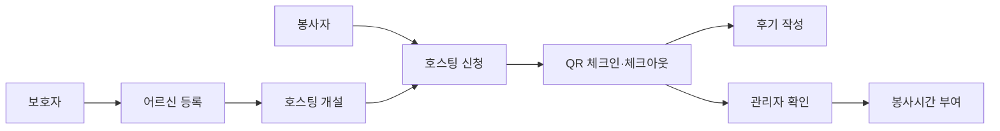
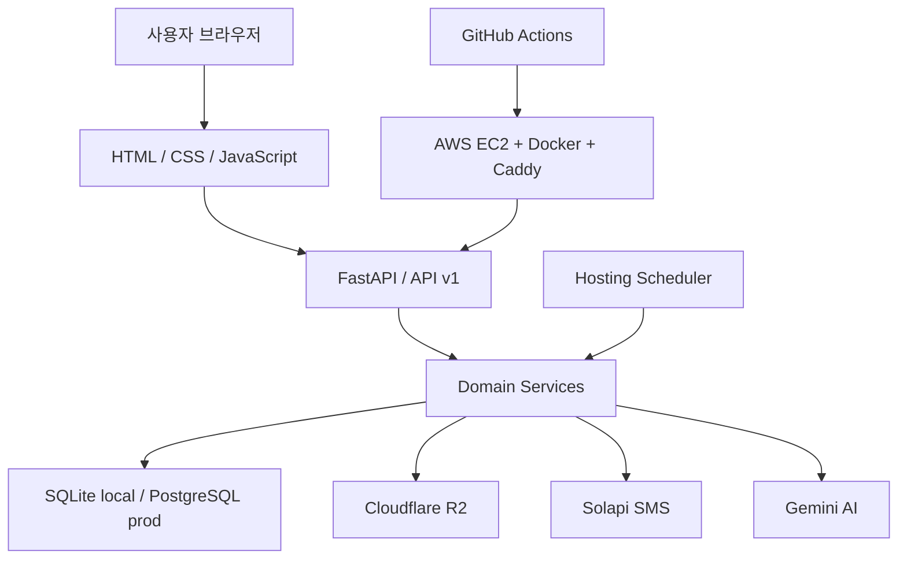

# 밥동무

<p align="center">
  <strong>독거 어르신의 집안일과 식사 시간을 생활 봉사로 연결하는 플랫폼</strong>
</p>

<p align="center">
  <a href="https://babdongmu.duckdns.org/">Live Demo</a>
  ·
  <a href="docs/FEATURES.md">기능 명세</a>
  ·
  <a href="docs/DATABASE.md">DB 설계</a>
  ·
  <a href="presentation/babdongmu-demo.html">발표 슬라이드</a>
</p>

<p align="center">
  
  
  
  
  
</p>

밥동무는 독거 어르신이 혼자 감당하기 어려운 청소, 쓰레기 배출 같은 일상 도움과 따뜻한 식사 시간을 하나의 방문 경험으로 연결합니다. 보호자는 어르신의 밥자리를 등록하고, 봉사자는 필요한 생활 봉사를 한 뒤 함께 식사를 나누며, 관리자는 기록과 봉사시간을 확인합니다.

---

## Team

- 개발 기간 : 2026.04.06 - 2026.05.15
- 구성 : 5인 팀 프로젝트

| 구성원 | 도메인 | 백엔드 | 프론트엔드 |
|------|------------|------------|----------------|
| **[김상혁](https://github.com/gabriel-1204)** | 인프라 / 배포 | 스켈레톤, Docker, CI/CD, 배포 | 랜딩페이지 |
| **[나솔림](https://github.com/solrimna)** | 관리자 / AI | 대시보드 API, 호스팅 승인, 통계, CoolSMS, Gemini AI 소개글 | admin.html |
| **[박지영](https://github.com/battlegroundcallofduty)** | 회원 / 인증 | 회원가입, 로그인, JWT, 서류 업로드, 신원검증 | login, register, mypage |
| **[서호근](https://github.com/azure5finger-cmyk)** | 어르신 / 호스팅 | 어르신 CRUD, 호스팅 CRUD, 보호자 관리 | guardian, hostings, hosting-detail |
| **[유민지](https://github.com/kittyjoa)** | 매칭 / 후기 | 매칭 신청, 체크인/아웃, 봉사시간, 후기 | my-matches |

---

## Why

혼자 사는 어르신에게 어려운 일은 거창한 문제가 아닐 때가 많습니다. 쓰레기를 버리는 일, 집을 정리하는 일, 냉장고를 열어도 함께 먹을 사람이 없는 시간이 쌓이면서 일상은 더 외로워집니다.

밥동무는 이 문제를 “밥만 같이 먹는 서비스”로 보지 않습니다. 봉사자가 먼저 필요한 일을 돕고, 그 끝에서 식사 시간을 함께 나누며 관계가 생기도록 설계했습니다.

| 문제 | 밥동무의 접근 |
|------|---------------|
| 어르신의 일상 부담 | 보호자가 도움이 필요한 어르신과 호스팅을 등록합니다. |
| 봉사 활동의 현장 기록 | QR 체크인·체크아웃으로 방문 시작과 종료를 남깁니다. |
| 보호자의 불안 | 체크인·체크아웃과 매칭 상태를 SMS와 관리자 기록으로 확인합니다. |
| 봉사시간 정산 | 관리자가 실제 기록을 보고 최종 봉사시간을 부여합니다. |

---

## How It Works

| 역할 | 사용 흐름 |
|------|-----------|
| 보호자 | 회원가입 후 어르신을 등록하고, 필요한 날짜와 장소로 호스팅을 엽니다. |
| 봉사자 | 승인된 계정으로 호스팅을 조회하고 신청한 뒤, 현장에서 QR로 방문을 기록합니다. |
| 관리자 | 신원 서류를 승인·반려하고, 방문 기록을 확인해 봉사시간과 통계를 관리합니다. |



---

## Demo

| 회원가입 | 보호자 호스팅 등록 |
|----------|--------------------|
|  |  |

| 봉사자 호스팅 신청 | QR 체크인·체크아웃 |
|--------------------|--------------------|
|  |  |

| 매칭 후기 작성 | 관리자 승인 | 어르신 QR 확인 |
|----------------|-------------|----------------|
|  |  |  |

---

## Features

| 영역 | 핵심 기능 |
|------|-----------|
| 회원·인증 | 이메일 로그인, JWT 인증, 역할 기반 접근, 서류 업로드와 신원검증 |
| 어르신 관리 | 보호자 전용 어르신 등록, 주소·특이사항·수용 인원 관리, QR UUID 발급 |
| 호스팅 | 날짜, 장소, 식사 메뉴, 모집 인원을 설정해 밥자리 개설 |
| 매칭 | 승인된 봉사자가 호스팅에 신청하고 방문 기록을 남기는 선착순 흐름 |
| QR 방문 기록 | 어르신별 QR로 체크인·체크아웃을 기록해 현장 방문을 확인 |
| 후기 | 체크아웃 완료 후 후기 작성, 후기 기반 Gemini AI 소개글 생성 |
| 관리자 | 서류 승인·반려, 봉사시간 최종 부여, 통계 확인 |
| 알림·파일 | Solapi SMS, Cloudflare R2 파일 저장, 스케줄러 기반 상태 전환 |

---

## Architecture



| 레이어 | 구성 |
|--------|------|
| Frontend | 정적 HTML, 공통 CSS, 페이지별 JavaScript |
| API | FastAPI, JWT 인증, `/api/v1` 라우터 |
| Domain | user, senior, hosting, match, review, admin, ai 도메인 분리 |
| Database | SQLAlchemy 2.x async, Alembic migration, SQLite/PostgreSQL |
| External | Solapi SMS, Cloudflare R2, Gemini AI |
| Deploy | Docker Compose, Caddy, AWS EC2, GitHub Actions |

---

## Getting Started

### 1. 환경 변수 준비

```bash
cp .env.example .env
```

`.env`에서 `SECRET_KEY`, `DATABASE_URL`, SMS/R2/Gemini 관련 값을 환경에 맞게 설정합니다. 로컬 SQLite로 시작하면 별도 PostgreSQL 없이도 실행할 수 있습니다.

### 2-A. uv로 실행

```bash
uv sync
uv run uvicorn app.main:app --reload
```

`.env`에서 `SECRET_KEY`, `DATABASE_URL`, SMS/R2/Gemini 관련 값을 환경에 맞게 설정합니다. 로컬 SQLite로 시작하면 별도 PostgreSQL 없이도 실행할 수 있습니다.

### 2-A. uv로 실행

```bash
uv sync
uv run uvicorn app.main:app --reload
```

### 2-B. pip으로 실행
### 2-B. pip으로 실행

```bash
python -m venv venv
source venv/bin/activate  # Windows: venv\Scripts\activate
pip install -r requirements.txt
uvicorn app.main:app --reload
```

### 2-C. Docker로 실행

```bash
docker compose up --build
```

### 3. 확인

- Frontend: http://localhost:8000
- Swagger UI: http://localhost:8000/docs
- OpenAPI JSON: http://localhost:8000/openapi.json

---

## Database & Migration
### 3. 확인

- Frontend: http://localhost:8000
- Swagger UI: http://localhost:8000/docs
- OpenAPI JSON: http://localhost:8000/openapi.json

---

## Database & Migration

| 상황 | 동작 |
|------|------|
| `babdongmu.db` 없음 | 서버 시작 시 SQLite 테이블을 자동 생성하고 Alembic head로 기록합니다. |
| `babdongmu.db` 있음 + `DEBUG=True` | 서버 시작 시 `alembic upgrade head`를 자동 실행합니다. |
| `babdongmu.db` 있음 + `DEBUG=False` | 자동 migration을 실행하지 않습니다. |
| 프로덕션 PostgreSQL | GitHub Actions 배포 과정에서 `alembic upgrade head`를 실행합니다. |
| `babdongmu.db` 없음 | 서버 시작 시 SQLite 테이블을 자동 생성하고 Alembic head로 기록합니다. |
| `babdongmu.db` 있음 + `DEBUG=True` | 서버 시작 시 `alembic upgrade head`를 자동 실행합니다. |
| `babdongmu.db` 있음 + `DEBUG=False` | 자동 migration을 실행하지 않습니다. |
| 프로덕션 PostgreSQL | GitHub Actions 배포 과정에서 `alembic upgrade head`를 실행합니다. |

모델 변경 후 직접 migration을 만들 때는 아래 명령을 사용합니다.
모델 변경 후 직접 migration을 만들 때는 아래 명령을 사용합니다.

```bash
alembic revision --autogenerate -m "변경내용"
alembic upgrade head
```

---

## Project Structure

```text
app/
├── main.py                 # FastAPI 앱 진입점
├── database.py             # SQLAlchemy async DB 연결과 로컬 migration 처리
├── scheduler.py            # 호스팅 상태 자동 전환 스케줄러
├── api/v1/router.py        # API 라우터 통합
├── core/security.py        # JWT와 비밀번호 해싱
├── domain/                 # 역할과 기능별 도메인
└── services/               # SMS, R2, QR, Gemini 연동

frontend/
├── index.html              # 랜딩 페이지
├── css/common.css          # 공통 스타일
├── js/                     # 페이지별 동작
└── pages/                  # 로그인, 회원가입, 호스팅, 관리자 등 화면

docs/
├── FEATURES.md             # 기능 명세
├── DATABASE.md             # DB 설계
└── bab_donmu_erd.html      # ERD
```

---

## Docs

| 문서 | 설명 |
|------|------|
| [기능 명세](docs/FEATURES.md) | 역할별 기능, 호스팅·매칭 상태, SMS 트리거를 정리합니다. |
| [DB 설계](docs/DATABASE.md) | 테이블, 컬럼, migration 운영 방법을 정리합니다. |
| [ERD](docs/bab_donmu_erd.html) | 데이터 관계를 시각적으로 확인합니다. |
| [발표 슬라이드](presentation/babdongmu-demo.html) | 최종 시연 발표용 웹 슬라이드입니다. |

---

## Development

```bash
ruff check app/
ruff format app/
pytest
```

커밋 전에는 `git status`로 변경 파일을 확인하고, 필요한 파일만 명시적으로 스테이징합니다.

---

## My Contributions

담당 도메인: **회원 / 인증** — 백엔드 API + 프론트엔드 (login, register, mypage)

### 회원가입 · 로그인 · JWT 인증
- 이메일 로그인, JWT 발급·검증 흐름 전담 구현
- 역할 기반 접근 제어(보호자 / 봉사자 / 관리자) — 역할별 가입 후 페이지 분기
- 비밀번호 8자 이상·확인 일치, 이메일 소문자 정규화, 빈 문자열 방지 등 스키마 레벨 입력 검증
- `get_current_user` 토큰 type 검증 추가 — 특수 토큰으로 일반 API 접근 차단

### SMS 전화번호 인증
- `secrets` 모듈 기반 6자리 인증코드 생성 (보안)
- SMS 인증코드 DB 테이블 설계 및 Alembic 마이그레이션 파일 작성
- 인증 완료 후 10분 유효, 만료 시간 조건 포함한 상태 검증
- 동일 번호 중복 가입 차단 — `get_user_by_phone_number` 라우터 레벨 체크
- 전화번호 정규화 로직 schemas 헬퍼 함수로 추출해 재사용

### 카카오 소셜 로그인
- 카카오 OAuth 2.0 연동 엔드포인트 3개 구현 (인가 코드, 토큰 교환, 사용자 정보 조회)
- CSRF 방지용 `state` 파라미터 추가, `oauth_state` 쿠키 검증 직후 삭제
- access_token을 URL fragment(`#`)로 전달해 서버 로그·히스토리 노출 방지
- 카카오 유저 전화번호 추가 등록 필수 처리, 비밀번호 변경 차단, 마이페이지 필드 조건부 hidden

### Cloudflare R2 서류 업로드 · 신원검증
- 서류 업로드 / 조회 / 삭제 API 구현 (R2 + DB 동기화)
- 매직 바이트 검증 + Pillow polyglot 파일 재검증으로 위장 파일 업로드 방어
- `asyncio.to_thread`로 R2 I/O를 별도 스레드에서 실행해 이벤트 루프 블로킹 방지
- 회원 탈퇴 시 R2 파일 + DB 레코드 동시 삭제, 보호자는 등록된 어르신 존재 시 탈퇴 차단
- 승인 거절 시 거절 사유 메시지 마이페이지에 표시

### 비밀번호 찾기
- 3단계 모달 플로우 (이메일 확인 → SMS 인증 → 새 비밀번호 설정) 백엔드 + 프론트 일괄 구현
- 비밀번호 찾기 전용 단기 토큰 발급 — 일반 API 접근 불가
- 응답에서 이메일 존재 여부가 노출되지 않도록 처리 (계정 열거 공격 방지)

### 정리 스케줄러
- 만료된 SMS 인증코드, 같은 유저의 동일 서류 타입 중 오래된 레코드, R2 고아 파일 자동 삭제
- 서비스별 삭제 함수를 `asyncio.gather`로 병렬 실행
- `DEBUG=True` 환경에서는 R2 정리 제외 (개발 중 팀원 파일 보호)
- 서버 기동 후 24시간 뒤 첫 실행, 환경 변수로 실행 주기 조정 가능

### 프론트엔드
- login.html / register.html / mypage.html 구현
- `format-utils.js` 공통 유틸 모듈 생성 (타임존 변환, 날짜 파싱, 전화번호 정규화)
- Daum 우편번호 API 연동 (주소 검색)
- `api.js` 에러 처리 공통화 — HTTP 상태 코드 포함, 네트워크 오류 메시지 명시

---

## Code Review & Trouble Shooting

### 비밀번호 찾기 — 전화번호 클라이언트 노출

**문제** : 1단계 응답에 실제 전화번호(`phone_number`)를 포함해 프론트엔드가 보관했다가 2단계에서 그대로 서버로 전송하는 구조였다.

**원인** : SMS 코드 검증(2단계)에 전화번호가 필요했고, 이를 클라이언트가 넘겨주는 방식으로 초기 설계했다. 코드리뷰에서 "전화번호가 클라이언트에 노출된다"고 지적받았다.

**해결** : 1단계 응답에서 `phone_number` 필드를 제거했다. 2단계에서는 클라이언트가 보낸 이메일로 서버가 직접 유저를 조회해 전화번호를 획득하도록 변경했다.

---

### 비밀번호 찾기 — 계정 열거 공격(Account Enumeration) 방지

**문제** : 없는 이메일이면 HTTP 404, 있으면 200을 반환해 공격자가 이메일 가입 여부를 구분할 수 있었다.

**원인** : "없으면 404"라는 일반적인 REST 패턴을 그대로 적용했다.

**해결** : 없는 이메일도 가짜 마스킹 번호(`010-****-****`)와 200을 반환해 응답 차이를 없앴다. 프론트엔드 안내 문구도 `"~로 인증코드를 발송했습니다"` → `"가입된 계정이 있다면 ~로 인증코드를 발송했습니다"`로 수정했다.

---

### 카카오 OAuth — CSRF 방어·토큰 노출·쿠키 잔류

**문제** : ① state 파라미터가 없어 CSRF 공격 가능 ② access_token을 쿼리스트링으로 전달해 서버 로그와 브라우저 히스토리에 노출 ③ 코드리뷰 반영 후 확인하다가 검증이 끝난 oauth_state 쿠키가 삭제되지 않고 남아있는 것을 추가로 발견했다.

**해결** :
- `secrets.token_urlsafe(32)`로 state 생성 → httpOnly 쿠키에 저장 → 콜백에서 검증
- 성공·에러·예외 4가지 분기 모두에 `response.delete_cookie("oauth_state")` 추가
- access_token을 fragment(`#`)로 전달하고, 프론트에서 읽은 직후 `history.replaceState`로 주소창에서도 제거

---

### 특수 목적 토큰으로 일반 API 접근 가능

**문제** : 카카오 가입용 `kakao_setup` 토큰, 비밀번호 찾기용 `password_reset` 토큰으로 일반 인증이 필요한 API(`/users/me` 등)를 호출할 수 있었다.

**원인** : `get_current_user`가 JWT 서명·만료만 검증하고 토큰의 `type` 필드는 확인하지 않았다. 특수 토큰을 새로 추가하면서 기존 인증 로직과의 충돌을 뒤늦게 인식했다.

**해결** : `payload.get("type") is not None`이면 즉시 401을 반환하도록 `get_current_user`에 3줄 추가했다. 특수 토큰은 각각의 전용 dependency에서만 검증한다.

---

## Project review

- **Refresh Token 미구현** — 카카오 로그인, 스케줄러 등 다른 기능 구현에 집중하다 보니 후반부에야 필요성을 인식했습니다. 발표까지 시간이 촉박해 구조를 변경하기 어려운 상황이었고, 프로젝트 안정성을 우선해 도입하지 않았습니다. 추후 개선한다면 가장 먼저 추가하고 싶은 기능입니다.

- **팀 소통의 중요성** — 초기 설계가 탄탄해도 개발 과정에서 요구사항이 달라질 수 있다는 것을 배웠습니다. 카카오 유저에게 전화번호 필드를 숨김 처리했다가 팀 논의를 통해 SMS 수신이 서비스 핵심 플로우임을 확인하고 필수 필드로 되돌린 경험이 있습니다. 또한 가입 시 서류 업로드를 필수로 뒀다가 중단 시 데이터 롤백 문제와 가입 절차의 번거로움이 우려돼 마이페이지에서 언제든 업로드할 수 있는 방식으로 변경했습니다. 개발 중에도 팀원들과 꾸준히 소통하는 것이 중요하다는 것을 실감했습니다.

- **배포와 Alembic** — 배포와 Alembic 마이그레이션을 다른 팀원들이 담당해줘서 제 역할에 집중할 수 있었습니다. 다음 프로젝트에서는 직접 다뤄보고 싶습니다.

- **비동기 구조 학습 필요성** — `asyncio.to_thread`로 boto3의 동기 블로킹 문제를 해결하면서 FastAPI 비동기 구조를 더 깊이 이해해야 한다는 필요성을 느꼈습니다. 이후 비동기 개념을 다시 정리하는 계기가 됐습니다.

- **프로젝트 주제에 대한 소감** — IT 기술에 익숙하지 않은 어르신들을 위한 서비스를 만드는 것 자체가 사회적으로 의미 깊다고 느꼈습니다. 고령화 사회에서 시니어 복지 분야에 IT를 접목하는 시도가 앞으로 더 넓어지면 좋겠다는 생각도 들었습니다. 사회적 가치를 넘어, 제대로 수익화한다면 충분히 사업성도 있는 분야라는 생각도 함께 들었습니다.

---
