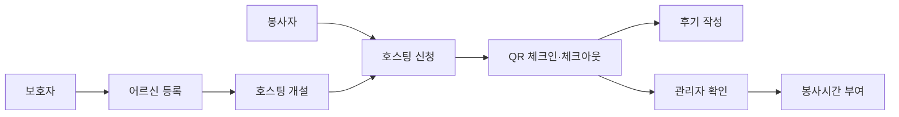
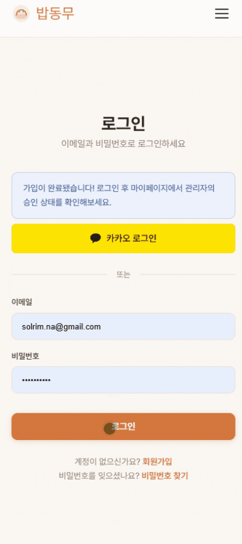
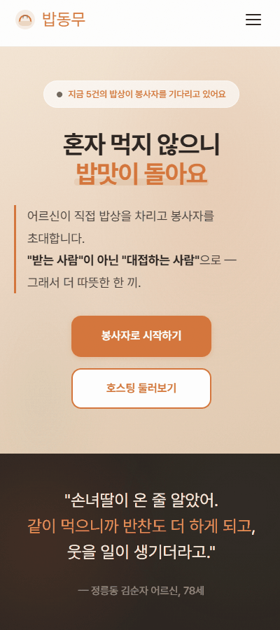
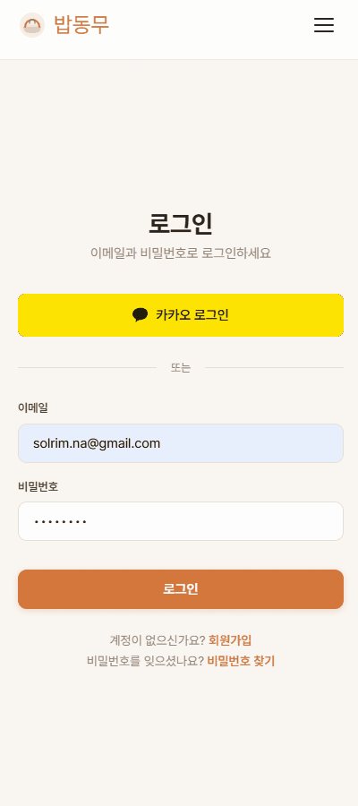
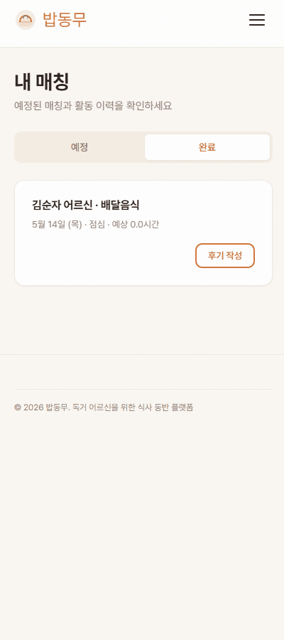
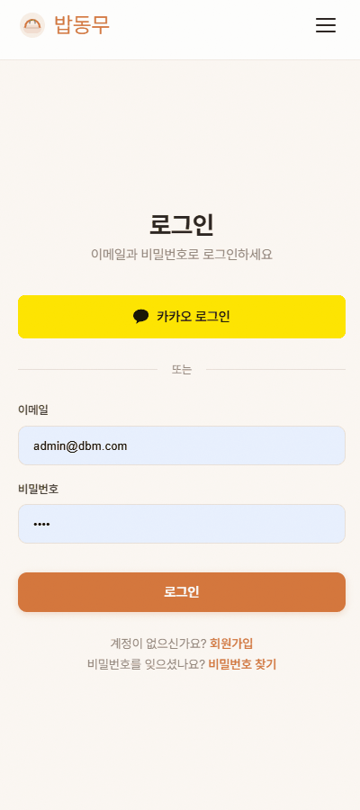
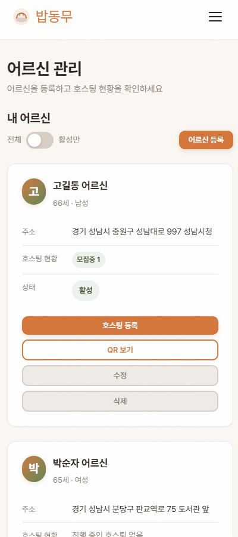
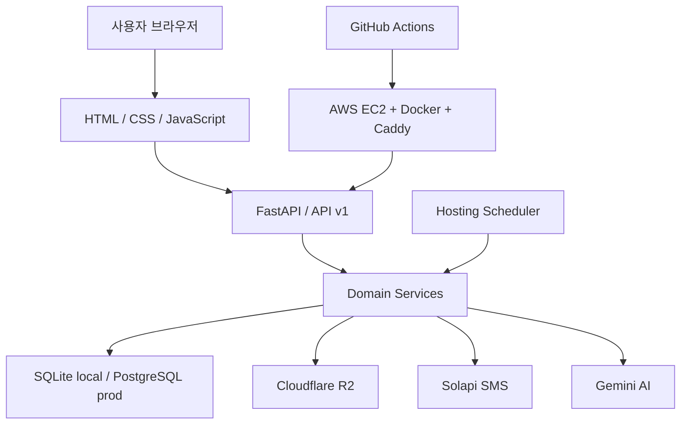

# 밥동무

<p align="center">
  <strong>독거 어르신의 집안일과 식사 시간을 생활 봉사로 연결하는 플랫폼</strong>
</p>

<p align="center">
  <a href="https://babdongmu.duckdns.org/">Live Demo</a>
  ·
  <a href="docs/FEATURES.md">기능 명세</a>
  ·
  <a href="docs/DATABASE.md">DB 설계</a>
  ·
  <a href="presentation/babdongmu-demo.html">발표 슬라이드</a>
</p>

<p align="center">
  
  
  
  
  
</p>

밥동무는 독거 어르신이 혼자 감당하기 어려운 청소, 쓰레기 배출 같은 일상 도움과 따뜻한 식사 시간을 하나의 방문 경험으로 연결합니다. 보호자는 어르신의 밥자리를 등록하고, 봉사자는 필요한 생활 봉사를 한 뒤 함께 식사를 나누며, 관리자는 기록과 봉사시간을 확인합니다.

---

## Why

혼자 사는 어르신에게 어려운 일은 거창한 문제가 아닐 때가 많습니다. 쓰레기를 버리는 일, 집을 정리하는 일, 냉장고를 열어도 함께 먹을 사람이 없는 시간이 쌓이면서 일상은 더 외로워집니다.

밥동무는 이 문제를 “밥만 같이 먹는 서비스”로 보지 않습니다. 봉사자가 먼저 필요한 일을 돕고, 그 끝에서 식사 시간을 함께 나누며 관계가 생기도록 설계했습니다.

| 문제 | 밥동무의 접근 |
|------|---------------|
| 어르신의 일상 부담 | 보호자가 도움이 필요한 어르신과 호스팅을 등록합니다. |
| 봉사 활동의 현장 기록 | QR 체크인·체크아웃으로 방문 시작과 종료를 남깁니다. |
| 보호자의 불안 | 체크인·체크아웃과 매칭 상태를 SMS와 관리자 기록으로 확인합니다. |
| 봉사시간 정산 | 관리자가 실제 기록을 보고 최종 봉사시간을 부여합니다. |

---

## How It Works

| 역할 | 사용 흐름 |
|------|-----------|
| 보호자 | 회원가입 후 어르신을 등록하고, 필요한 날짜와 장소로 호스팅을 엽니다. |
| 봉사자 | 승인된 계정으로 호스팅을 조회하고 신청한 뒤, 현장에서 QR로 방문을 기록합니다. |
| 관리자 | 신원 서류를 승인·반려하고, 방문 기록을 확인해 봉사시간과 통계를 관리합니다. |



---

## Demo

| 회원가입 | 보호자 호스팅 등록 |
|----------|--------------------|
|  |  |

| 봉사자 호스팅 신청 | QR 체크인·체크아웃 |
|--------------------|--------------------|
|  |  |

| 매칭 후기 작성 | 관리자 승인 | 어르신 QR 확인 |
|----------------|-------------|----------------|
|  |  |  |

---

## Features

| 영역 | 핵심 기능 |
|------|-----------|
| 회원·인증 | 이메일 로그인, JWT 인증, 역할 기반 접근, 서류 업로드와 신원검증 |
| 어르신 관리 | 보호자 전용 어르신 등록, 주소·특이사항·수용 인원 관리, QR UUID 발급 |
| 호스팅 | 날짜, 장소, 식사 메뉴, 모집 인원을 설정해 밥자리 개설 |
| 매칭 | 승인된 봉사자가 호스팅에 신청하고 방문 기록을 남기는 선착순 흐름 |
| QR 방문 기록 | 어르신별 QR로 체크인·체크아웃을 기록해 현장 방문을 확인 |
| 후기 | 체크아웃 완료 후 후기 작성, 후기 기반 Gemini AI 소개글 생성 |
| 관리자 | 서류 승인·반려, 봉사시간 최종 부여, 통계 확인 |
| 알림·파일 | Solapi SMS, Cloudflare R2 파일 저장, 스케줄러 기반 상태 전환 |

---

## Architecture



| 레이어 | 구성 |
|--------|------|
| Frontend | 정적 HTML, 공통 CSS, 페이지별 JavaScript |
| API | FastAPI, JWT 인증, `/api/v1` 라우터 |
| Domain | user, senior, hosting, match, review, admin, ai 도메인 분리 |
| Database | SQLAlchemy 2.x async, Alembic migration, SQLite/PostgreSQL |
| External | Solapi SMS, Cloudflare R2, Gemini AI |
| Deploy | Docker Compose, Caddy, AWS EC2, GitHub Actions |

---

## Getting Started

### 1. 환경 변수 준비

```bash
cp .env.example .env
```

`.env`에서 `SECRET_KEY`, `DATABASE_URL`, SMS/R2/Gemini 관련 값을 환경에 맞게 설정합니다. 로컬 SQLite로 시작하면 별도 PostgreSQL 없이도 실행할 수 있습니다.

### 2-A. uv로 실행

```bash
uv sync
uv run uvicorn app.main:app --reload
```

### 2-B. pip으로 실행

```bash
python -m venv venv
source venv/bin/activate  # Windows: venv\Scripts\activate
pip install -r requirements.txt
uvicorn app.main:app --reload
```

### 2-C. Docker로 실행

```bash
docker compose up --build
```

### 3. 확인

- Frontend: http://localhost:8000
- Swagger UI: http://localhost:8000/docs
- OpenAPI JSON: http://localhost:8000/openapi.json

---

## Database & Migration

| 상황 | 동작 |
|------|------|
| `babdongmu.db` 없음 | 서버 시작 시 SQLite 테이블을 자동 생성하고 Alembic head로 기록합니다. |
| `babdongmu.db` 있음 + `DEBUG=True` | 서버 시작 시 `alembic upgrade head`를 자동 실행합니다. |
| `babdongmu.db` 있음 + `DEBUG=False` | 자동 migration을 실행하지 않습니다. |
| 프로덕션 PostgreSQL | GitHub Actions 배포 과정에서 `alembic upgrade head`를 실행합니다. |

모델 변경 후 직접 migration을 만들 때는 아래 명령을 사용합니다.

```bash
alembic revision --autogenerate -m "변경내용"
alembic upgrade head
```

---

## Project Structure

```text
app/
├── main.py                 # FastAPI 앱 진입점
├── database.py             # SQLAlchemy async DB 연결과 로컬 migration 처리
├── scheduler.py            # 호스팅 상태 자동 전환 스케줄러
├── api/v1/router.py        # API 라우터 통합
├── core/security.py        # JWT와 비밀번호 해싱
├── domain/                 # 역할과 기능별 도메인
└── services/               # SMS, R2, QR, Gemini 연동

frontend/
├── index.html              # 랜딩 페이지
├── css/common.css          # 공통 스타일
├── js/                     # 페이지별 동작
└── pages/                  # 로그인, 회원가입, 호스팅, 관리자 등 화면

docs/
├── FEATURES.md             # 기능 명세
├── DATABASE.md             # DB 설계
└── bab_donmu_erd.html      # ERD
```

---

## Docs

| 문서 | 설명 |
|------|------|
| [기능 명세](docs/FEATURES.md) | 역할별 기능, 호스팅·매칭 상태, SMS 트리거를 정리합니다. |
| [DB 설계](docs/DATABASE.md) | 테이블, 컬럼, migration 운영 방법을 정리합니다. |
| [ERD](docs/bab_donmu_erd.html) | 데이터 관계를 시각적으로 확인합니다. |
| [발표 슬라이드](presentation/babdongmu-demo.html) | 최종 시연 발표용 웹 슬라이드입니다. |

---

## Development

```bash
ruff check app/
ruff format app/
pytest
```

커밋 전에는 `git status`로 변경 파일을 확인하고, 필요한 파일만 명시적으로 스테이징합니다.
